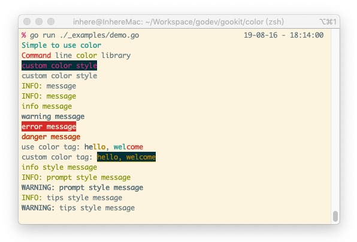

# CLI Color

[](https://app.codacy.com/app/inhere/color)
[](https://pkg.go.dev/github.com/gookit/color?tab=overview)
[](https://github.com/gookit/color)
[](https://travis-ci.org/gookit/color)
[](https://coveralls.io/github/gookit/color?branch=master)
[](https://goreportcard.com/report/github.com/gookit/color)

Golang下的命令行色彩使用库, 拥有丰富的色彩渲染输出，通用的API方法，兼容Windows系统

> **[EN README](README.md)**

基本颜色预览：


## 功能特色

  - 使用简单方便，无其他依赖
  - 支持丰富的颜色输出, 16色(4bit)，256色(8bit)，RGB色彩(24bit)
    - 16色(4bit)是最常用和支持最广的，支持Windows `cmd.exe`
    - 另外两种支持 `linux` `mac` 和 Windows下的 `ConEmu` `git-bash` `mintty` 等部分终端
  - 通用的API方法：`Print` `Printf` `Println` `Sprint` `Sprintf`
  - 同时支持html标签式的颜色渲染. eg: `<green>message</>`
  - 基础色彩: `Bold` `Black` `White` `Gray` `Red` `Green` `Yellow` `Blue` `Magenta` `Cyan`
  - 扩展风格: `Info` `Note` `Light` `Error` `Danger` `Notice` `Success` `Comment` `Primary` `Warning` `Question` `Secondary`
  - 支持Linux、Mac同时兼容Windows系统环境

## GoDoc

  - [godoc for gopkg](https://pkg.go.dev/gopkg.in/gookit/color.v1)
  - [godoc for github](https://pkg.go.dev/github.com/gookit/color)

## 快速开始

如下，引入当前包就可以快速的使用

```bash
import "gopkg.in/gookit/color.v1" // 推荐
// or
import "github.com/gookit/color"
```

### 如何使用

```go
package main

import (
	"fmt"
	
	"github.com/gookit/color"
)

func main() {
	// 简单快速的使用，跟 fmt.Print* 类似
	color.Red.Println("Simple to use color")
	color.Green.Print("Simple to use color\n")
	color.Cyan.Printf("Simple to use %s\n", "color")
	color.Yellow.Printf("Simple to use %s\n", "color")

	// use like func
	red := color.FgRed.Render
	green := color.FgGreen.Render
	fmt.Printf("%s line %s library\n", red("Command"), green("color"))

	// 自定义颜色
	color.New(color.FgWhite, color.BgBlack).Println("custom color style")

	// 也可以:
	color.Style{color.FgCyan, color.OpBold}.Println("custom color style")
	
	// internal style:
	color.Info.Println("message")
	color.Warn.Println("message")
	color.Error.Println("message")
	
	// 使用颜色标签
	color.Print("<suc>he</><comment>llo</>, <cyan>wel</><red>come</>\n")

	// apply a style tag
	color.Tag("info").Println("info style text")

	// prompt message
	color.Info.Prompt("prompt style message")
	color.Warn.Prompt("prompt style message")

	// tips message
	color.Info.Tips("tips style message")
	color.Warn.Tips("tips style message")
}
```

> 运行 demo: `go run ./_examples/demo.go`



## 构建风格

```go
// 仅设置前景色
color.FgCyan.Printf("Simple to use %s\n", "color")
// 仅设置背景色
color.BgRed.Printf("Simple to use %s\n", "color")

// 完全自定义: 前景色 背景色 选项
style := color.New(color.FgWhite, color.BgBlack, color.OpBold)
style.Println("custom color style")

// 也可以:
color.Style{color.FgCyan, color.OpBold}.Println("custom color style")
```

直接设置控制台属性：

```go
// 设置console颜色
color.Set(color.FgCyan)

// 输出信息
fmt.Print("message")

// 重置console颜色
color.Reset()
```

> 当然，color已经内置丰富的色彩风格支持

## 基础颜色方法

> 支持在windows `cmd.exe` 使用

  - `color.Bold`
  - `color.Black`
  - `color.White`
  - `color.Gray`
  - `color.Red`
  - `color.Green`
  - `color.Yellow`
  - `color.Blue`
  - `color.Magenta`
  - `color.Cyan`

```go
color.Bold.Println("bold message")
color.Yellow.Println("yellow message")
```

> 运行demo: `go run ./_examples/basiccolor.go`


## 扩展风格方法 

> 支持在windows `cmd.exe` 使用

  - `color.Info`
  - `color.Note`
  - `color.Light`
  - `color.Error`
  - `color.Danger`
  - `color.Notice`
  - `color.Success`
  - `color.Comment`
  - `color.Primary`
  - `color.Warning`
  - `color.Question`
  - `color.Secondary`

### 基础风格

```go
// print message
color.Info.Println("Info message")
color.Success.Println("Success message")
```

Run demo: `go run ./_examples/theme_basic.go`


### 简约提示风格

```go
color.Info.Tips("tips style message")
color.Warn.Tips("tips style message")
```

Run demo: `go run ./_examples/theme_tips.go`


### 着重提示风格

```go
color.Info.Prompt("prompt style message")
color.Warn.Prompt("prompt style message")
```

Run demo: `go run ./_examples/theme_prompt.go`


### 强调提示风格

```go
color.Info.Block("prompt style message")
color.Warn.Block("prompt style message")
```

Run demo: `go run ./_examples/theme_block.go`


### 使用颜色标签

> **支持** 在windows `cmd.exe` `PowerShell` 使用

使用内置的颜色标签，可以非常方便简单的构建自己需要的任何格式

```go
// 使用内置的 color tag
color.Print("<suc>he</><comment>llo</>, <cyan>wel</><red>come</>")
color.Println("<suc>hello</>")
color.Println("<error>hello</>")
color.Println("<warning>hello</>")

// 自定义颜色属性
color.Print("<fg=yellow;bg=black;op=underscore;>hello, welcome</>\n")
```

  - 使用 `color.Tag`

给后面输出的文本信息加上给定的颜色风格标签

```go
// set a style tag
color.Tag("info").Print("info style text")
color.Tag("info").Printf("%s style text", "info")
color.Tag("info").Println("info style text")
```

> 运行 demo: `go run ./_examples/colortag.go`


## 256色使用

> 256色彩在 `v1.2.4` 后支持Windows CMD,PowerShell 环境

### 使用前景或后景色
 
  - `color.C256(val uint8, isBg ...bool) Color256`

```go
c := color.C256(132) // fg color
c.Println("message")
c.Printf("format %s", "message")

c := color.C256(132, true) // bg color
c.Println("message")
c.Printf("format %s", "message")
```

### 使用风格

> 可同时设置前景和背景色
 
  - `color.S256(fgAndBg ...uint8) *Style256`

```go
s := color.S256(32, 203)
s.Println("message")
s.Printf("format %s", "message")
```

> 运行 demo: `go run ./_examples/color256.go`


## RGB色彩使用

> RGB色彩在 `v1.2.4` 后支持Windows CMD,PowerShell 环境

代码示例：

```go
color.RGB(30, 144, 255).Println("message. use RGB number")

color.HEX("#1976D2").Println("blue-darken")
color.HEX("#D50000", true).Println("red-accent. use HEX style")

color.RGBStyleFromString("213,0,0").Println("red-accent. use RGB number")
color.HEXStyle("eee", "D50000").Println("deep-purple color")
```

### 使用前景或后景色 

  - `color.RGB(r, g, b uint8, isBg ...bool) RGBColor`

```go
c := color.RGB(30,144,255) // fg color
c.Println("message")
c.Printf("format %s", "message")

c := color.RGB(30,144,255, true) // bg color
c.Println("message")
c.Printf("format %s", "message")
```

  - `color.HEX(hex string, isBg ...bool) RGBColor` 从16进制颜色创建

```go
c := HEX("ccc") // 也可以写为: "cccccc" "#cccccc"
c.Println("message")
c.Printf("format %s", "message")

c = HEX("aabbcc", true) // as bg color
c.Println("message")
c.Printf("format %s", "message")
```

### 使用风格

> 可同时设置前景和背景色

  - `color.NewRGBStyle(fg RGBColor, bg ...RGBColor) *RGBStyle`

```go
s := NewRGBStyle(RGB(20, 144, 234), RGB(234, 78, 23))
s.Println("message")
s.Printf("format %s", "message")
```

  - `color.HEXStyle(fg string, bg ...string) *RGBStyle` 从16进制颜色创建

```go
s := HEXStyle("11aa23", "eee")
s.Println("message")
s.Printf("format %s", "message")
```

## Gookit 工具包

  - [gookit/ini](https://github.com/gookit/ini) INI配置读取管理，支持多文件加载，数据覆盖合并, 解析ENV变量, 解析变量引用
  - [gookit/rux](https://github.com/gookit/rux) Simple and fast request router for golang HTTP 
  - [gookit/gcli](https://github.com/gookit/gcli) Go的命令行应用，工具库，运行CLI命令，支持命令行色彩，用户交互，进度显示，数据格式化显示
  - [gookit/event](https://github.com/gookit/event) Go实现的轻量级的事件管理、调度程序库, 支持设置监听器的优先级, 支持对一组事件进行监听
  - [gookit/cache](https://github.com/gookit/cache) 通用的缓存使用包装库，通过包装各种常用的驱动，来提供统一的使用API
  - [gookit/config](https://github.com/gookit/config) Go应用配置管理，支持多种格式（JSON, YAML, TOML, INI, HCL, ENV, Flags），多文件加载，远程文件加载，数据合并
  - [gookit/color](https://github.com/gookit/color) CLI 控制台颜色渲染工具库, 拥有简洁的使用API，支持16色，256色，RGB色彩渲染输出
  - [gookit/filter](https://github.com/gookit/filter) 提供对Golang数据的过滤，净化，转换
  - [gookit/validate](https://github.com/gookit/validate) Go通用的数据验证与过滤库，使用简单，内置大部分常用验证、过滤器
  - [gookit/goutil](https://github.com/gookit/goutil) Go 的一些工具函数，格式化，特殊处理，常用信息获取等
  - 更多请查看 https://github.com/gookit

## 参考项目
  
  - `issue9/term` https://github.com/issue9/term
  - `beego/bee` https://github.com/beego/bee
  - `inhere/console` https://github/inhere/php-console
  - [ANSI转义序列](https://zh.wikipedia.org/wiki/ANSI转义序列)
  - [Standard ANSI color map](https://conemu.github.io/en/AnsiEscapeCodes.html#Standard_ANSI_color_map)

## License

MIT
